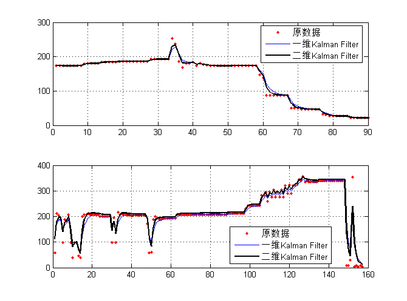

## Description

这是一个Kalman Filter的程序，内含状态量为标量和二维矢量的C程序实现，详见`kalman_filter.c`与`kalman_filter.h`。

程序使用的数据类型是`float`，程序测试主要在PC上和TMS320C6000的嵌入式平台。当然，因为是C程序，移植到其它的平台那是特别的方便！

`fixed_test1.h``fixed_test2.h`以及`free_test07.h`包含了测试用的数据。`test_kalman_filter.c`只是一个包含`main`函数测试程序。

## Example

环境要求：gcc的C编译环境，当然最好有Matlab环境可以非常直观方便的看到滤波效果。

1.	在`test_kalman_filter.c`中修改要使用Kalman滤波的数据，只要修改include包含即可

	```
	//#include "fixed_test1.h"
	#include "fixed_test2.h"
	//#include "free_test07.h"
	```

2.	推荐使用已经写好的Makefile文件进行编译执行，在gcc环境中，依次执行以下命令：

	```
	make       " gcc编译程序
	make run   " 运行程序
	```

	之后数据和滤波结果会存储到当前目录的result.txt文件中（第一列为原数据，第二列为滤波结果）

3.	运行Matlab，执行脚本`plot_result.m`，选择`result.txt`文件即可查看滤波效果，下面为使用标量滤波的效果，卡尔曼滤波器使突变的数据变得平滑。

	

## Usage

实际使用时只需要将`kalman_filter.c`与`kalman_filter.h`拷贝到工程目录中即可，调用的步骤一律按照：

```
kalman_init(..., init_x, init_p)
kalman_filter(..., z_measure)
```

本程序未包含自适应调参，因此请根据实际应用环境仔细调整，很重要。关于调参有很多可研究的地方，主要需要设定的参数如下：

1.	init_x：待测量的初始值，如有中值一般设成中值（如陀螺仪）
2.	init_p：后验状态估计值误差的方差的初始值
3.	q：预测（过程）噪声方差
4.	r：测量（观测）噪声方差。以陀螺仪为例，测试方法是：保持陀螺仪不动，统计一段时间内的陀螺仪输出数据。数据会近似正态分布，按3σ原则，取正态分布的(3σ)^2作为r的初始化值。

其中q和r参数尤为重要，一般得通过实验测试得到。

关于Kalman滤波的详细公式推导参见论文[An Introduction to the Kalman Filter](http://www.cs.unc.edu/~welch/media/pdf/kalman_intro.pdf).

## About me

Email: <xiahouzuoxin@163.com>

Copyright (C) MICL,USTB
